<p align="center"></p>

<h1 align="center">Inboxora</h1>

<p align="center">Self-hosted unified inbox for email, contacts and calendars.</p>

<p align="center">
  <a href="https://github.com/Dragonk/Inboxora/actions/workflows/ci.yml"></a>
  <a href="LICENSE"></a>
  
</p>

Inboxora brings email, contacts and calendars into one self-hosted workspace. Use existing
accounts over **IMAP/SMTP**, or connect **Gmail, Google Calendar and People APIs** and
**Microsoft Graph**. CalDAV and CardDAV keep your other applications and devices connected.

**Current release: 4.2.0.** [Download the apps](https://github.com/Dragonk/Inboxora/releases/tag/v4.2.0)
or deploy the versioned Docker images. Full documentation lives in the
[Wiki](https://github.com/Dragonk/Inboxora/wiki).

## What's new in 4.2.0

- **More control over sending.** Schedule mail, use a 0/15/30/60-second Undo Send window, or
  send a private copy to each recipient with mail merge. The Scheduled view has an inbox-style
  preview, attachments and paused editing that cannot send at the old deadline.
- **Sender and recipient defaults.** Choose a default From address per account, match replies
  to the configured alias actually contacted, and save removable default CC/BCC recipients
  below the signature. Drafts and manual edits retain their identities.
- **One place for accounts.** General → Accounts manages mail and DAV connections; calendar
  appearance has its own page. Collection editors, diagnostics, native menus and notifications
  work consistently across desktop and mobile.
- **More reliable synchronization.** Durable read/star recovery, accurate folder/thread counts,
  Gmail history and list fixes, and safe calendar/contact disappearance and rediscovery.
- **Storage and migration fixes.** Large-mailbox header repair now finishes in bounded batches
  with visible progress. Obsolete IMAP callbacks no longer report “Host must be a string” after
  an account switches to Google API or Graph. Existing false errors are cleared automatically.

See the [4.2.0 release notes](docs/wiki/Release-notes-4.2.0.md) for the full changes, migration
order and limitations. This release preserves existing administrator prefetch/retention controls;
cache expiry is not mail deletion, and freed PostgreSQL pages need not immediately shrink files.

## Highlights

- **A unified inbox with real threading.** Independent threaded list and conversation reader,
  physical folder copies, aliases, rules, search, snooze, spam controls and sandboxed HTML.
- **Calendar integrated with mail.** Month/week/work-week/agenda views, recurrence, invitations,
  local and provider calendars, external DAV/ICS subscriptions and contact birthdays.
- **Rich contacts and DAV.** Multiple books, CSV/vCard import/export, provider write-back where
  enabled, and revocable application passwords for other CalDAV/CardDAV clients.
- **Desktop and mobile.** Resizable panes, themes, nine languages, installable PWA, Windows/Linux
  desktop apps and an Android app with UnifiedPush notifications.

## Attachment previews in development

The `dev` reader opens PDF at 100%, uses compact icon actions and search, and fills the mobile
viewport. Images rotate both ways. Desktop previews can move into a floating window and back
to fullscreen; PDF/images also have a native-browser action using private, short-lived blobs.

Supported readers include images, PDF, DOCX with page/background preservation, spreadsheets,
Markdown/Mermaid, structured text, ZIP/7z/RAR/TAR/compressed streams, media, HTML/EML and contact/calendar cards.
The signature dialog separates integrity, certificate trust and revocation, with green/red/yellow
results rather than treating a signature field as valid. Optional ClamAV blocks unsafe or unscannable
previews but permits a warned download. All attachment/API access still requires the owning session.
The composer accepts file drops, checks sender limits and offers a configurable large-attachment warning.

See [development release notes](docs/wiki/Release-notes-Unreleased.md) for trust configuration,
optional ClamAV setup, format limitations and resource budgets. Deploy both development images together.

## Screenshots

Captured from the running application in one consistent style, on desktop (1440×900) and phone
(390×844). The complete set lives in [`media/screenshots/`](media/screenshots/) and is
regenerated by CI, so it always shows the current interface.

### Email

On desktop, captured with the conversation expanded in the list and a message open in the reading
pane:

| Unified inbox — thread expanded, message open | Conversation reader — full thread history | Composer |
| --- | --- | --- |
| 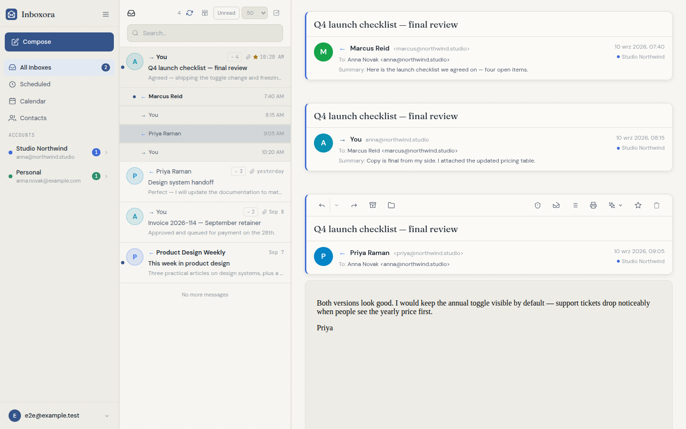 | 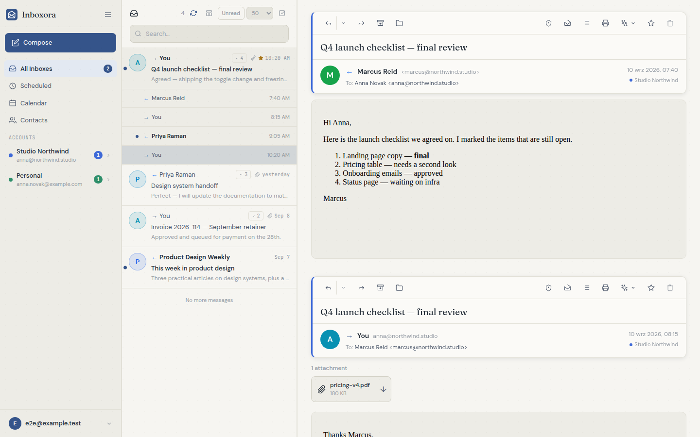 | 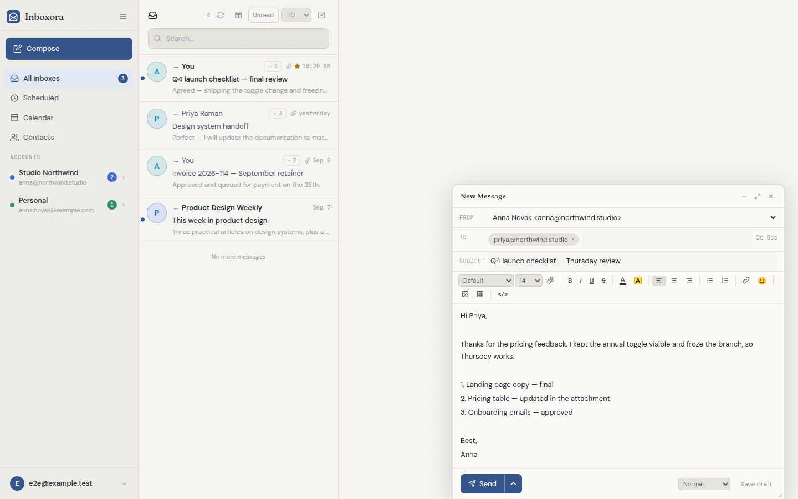 |

The same mailbox on a phone (390×844):

| Conversation reader | Composer |
| --- | --- |
|  | 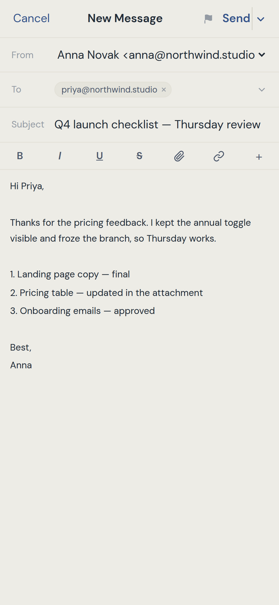 |

### Calendar

| Month | Week |
| --- | --- |
| 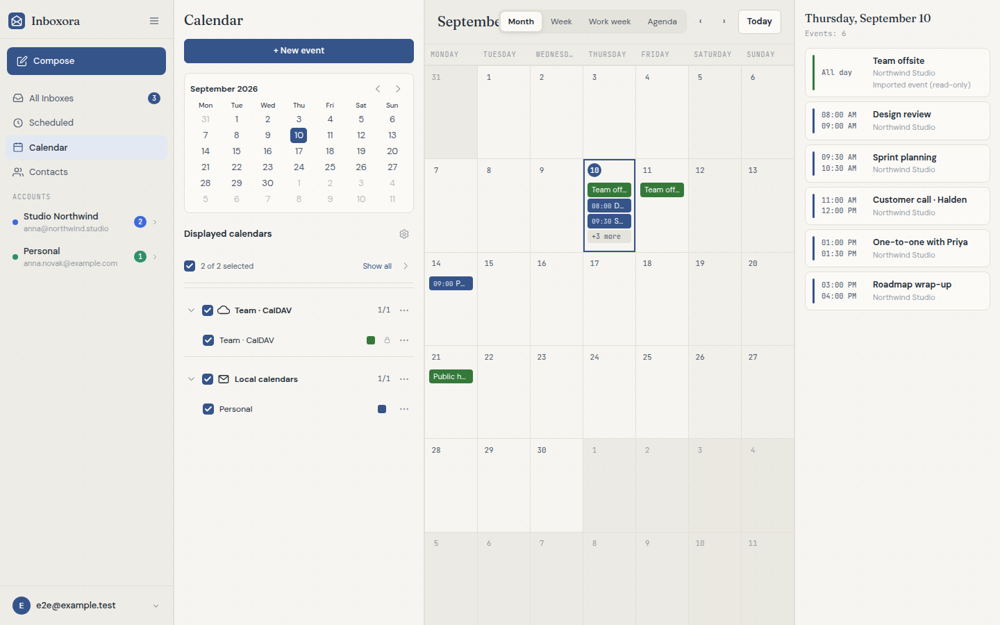 | 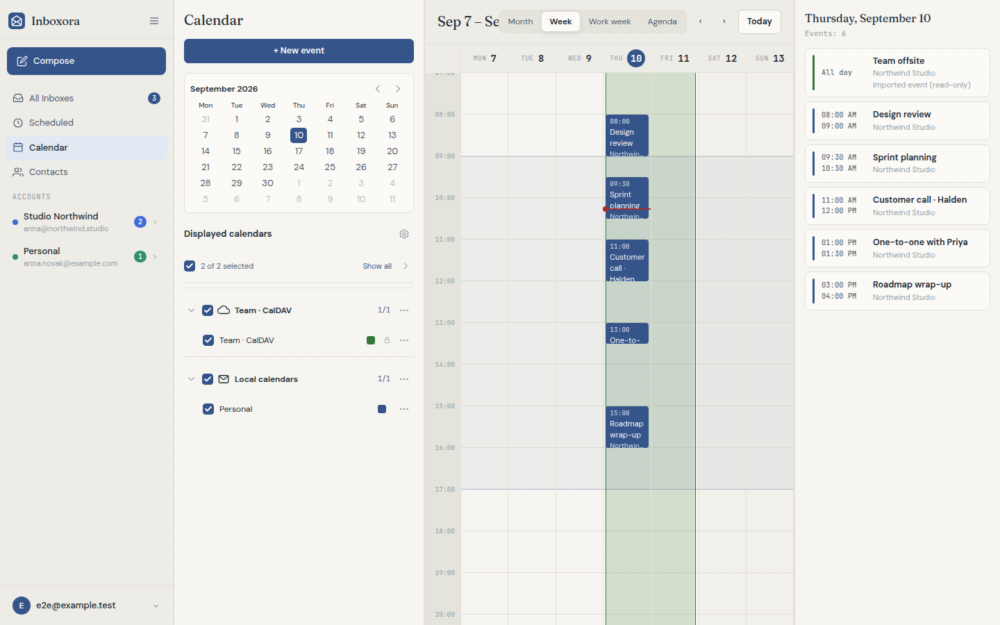 |

| Agenda | Calendar on phone |
| --- | --- |
| 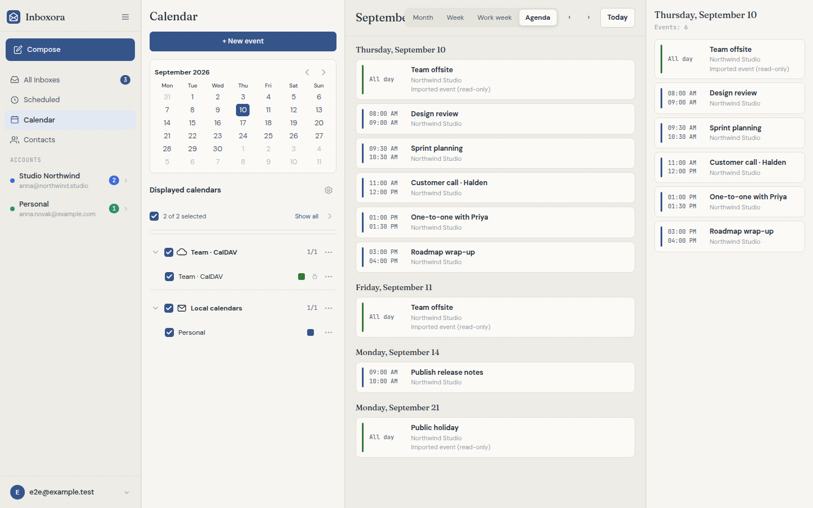 | 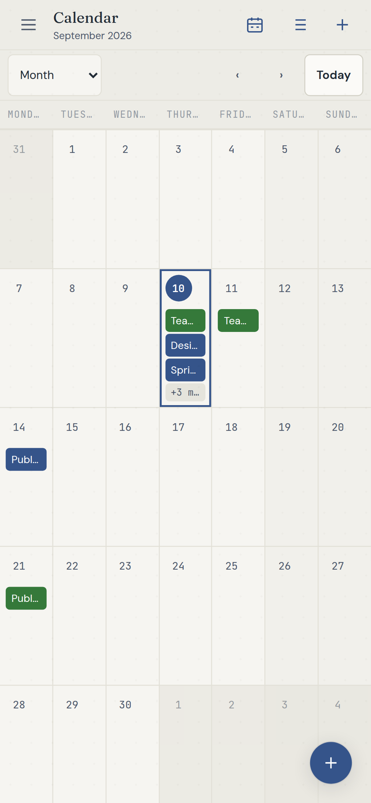 |

### Contacts

| Contact details | Rich contact editor |
| --- | --- |
| 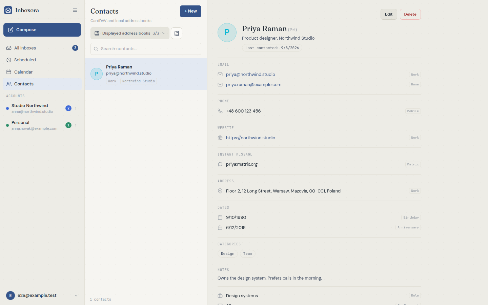 | 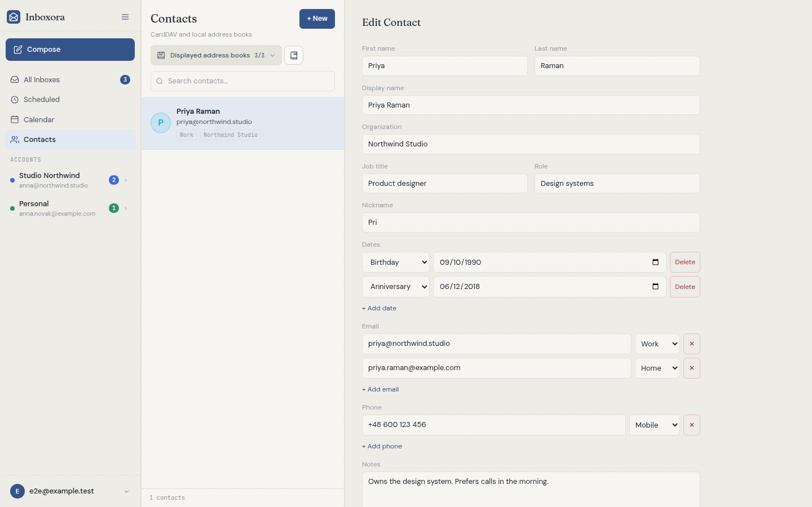 |

### Phone navigation, top or bottom

| Navigation at the top | Navigation at the bottom |
| --- | --- |
| 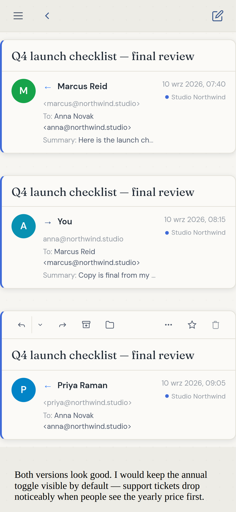 | 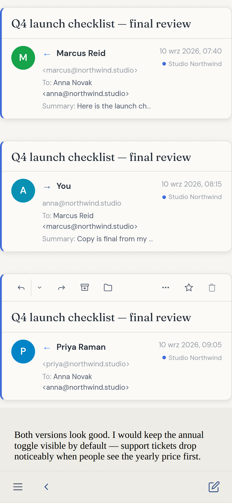 |

### DAV access

| Application passwords | On phone |
| --- | --- |
| 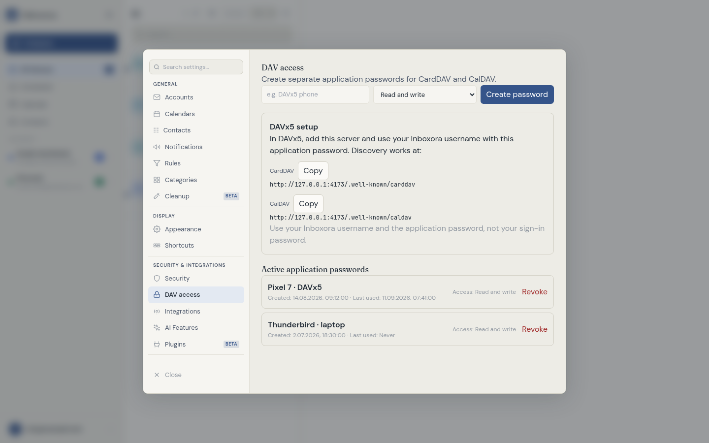 | 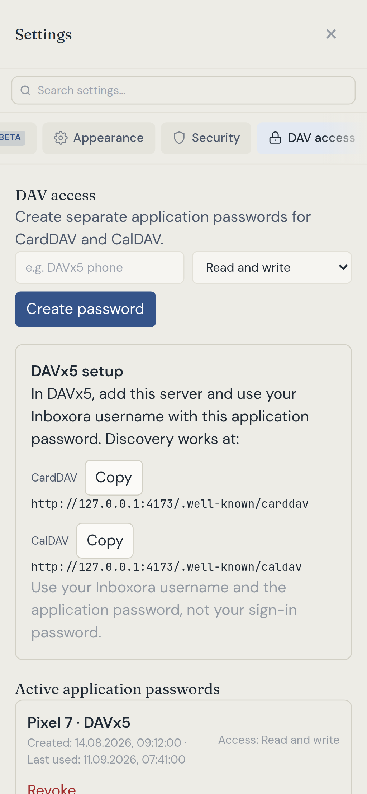 |

## Quick start

Use Docker Compose with the prebuilt release images:

```bash
mkdir inboxora && cd inboxora
curl -o docker-compose.yml https://raw.githubusercontent.com/Dragonk/Inboxora/v4.2.0/docker-compose.ghcr.yml
curl -o .env https://raw.githubusercontent.com/Dragonk/Inboxora/v4.2.0/.env.example
# Edit .env: set APP_URL, SESSION_SECRET, DB_PASSWORD and ENCRYPTION_KEY.
# Add INBOXORA_VERSION=4.2.0 to pin both app images.
docker compose up -d
docker compose ps
```

Open your configured HTTPS `APP_URL` and create the first administrator account. PostgreSQL,
Redis and the bundled ntfy service use persistent storage. Keep `.env` private and preserve
`ENCRYPTION_KEY`: losing it makes saved credentials unreadable. Use your reverse proxy and do
not expose internal service ports publicly. The Wiki covers proxy, DAV and notification setup.

```text
ghcr.io/dragonk/inboxora-backend:4.2.0
ghcr.io/dragonk/inboxora-frontend:4.2.0
```

Both images support AMD64 and ARM64. `latest` follows the current stable release; `dev` is a
separate, mutable test build. Native apps connect to your server rather than replacing it.

**Upgrading?** Back up PostgreSQL and the matching `.env`, retain your current database/volume
names, and update backend and frontend together. Startup applies the migration chain through
**0166**. Follow the [upgrade guide](docs/wiki/Upgrading.md#upgrading-to-420); do not delete an
account, reset cursors or recreate volumes to clear a migration error.

## Platforms

| Platform | Package / behavior |
| --- | --- |
| Web / PWA | Browser application with optional Web Push and unread badge. |
| Windows | Electron installer with server selection, tray, mailto handling and update checks. |
| Linux | Electron DEB and RPM packages for x64 and ARM64. |
| Android | Capacitor APK/AAB. Closed-app notifications require a configured UnifiedPush distributor such as ntfy. |

The release includes artifact checksums and a detached signature with the documented public
key. Provider synchronization and device push notifications are separate: enabling one does
not guarantee the other. Scheduled delivery requires the server and provider to be available.
Undo Send is a pre-submission delay, not recall of mail already accepted by a provider.

## Connecting accounts

Add mailboxes and DAV connections under **Settings → General → Accounts**. Google with an
app password over IMAP/SMTP remains supported; switching to the Gmail API is explicit and
in place. An administrator configures provider applications in Integrations, while each user
authorizes their own mail/calendar/contact access from Accounts. Native Google/Graph accounts
do not need dummy IMAP or SMTP hosts. Provider send-as and collection-write permissions still
apply independently of Inboxora preferences.

Moving from MailFlow? **MailFlow 3.3.0 is the supported migration source.** Keep the original
encryption key, database name, role and volumes. The Wiki contains the supported migration
procedure; do not start an empty database under a new name over an existing deployment.

## Documentation

The **[Wiki](https://github.com/Dragonk/Inboxora/wiki)** is the documentation entry point.
It contains setup, configuration, troubleshooting, upgrade guidance and the current release
notes. Older release notes are grouped under **Archive** with their original page addresses.
The reviewed source lives in [`docs/wiki/`](docs/wiki/); all versioned changes remain in
[`docs/CHANGELOG.md`](docs/CHANGELOG.md).

## Development

Work is integrated on `dev`; `main` receives changes through reviewed pull requests. GitHub
Actions runs unit, PostgreSQL, migration, browser, translation and screenshot checks. Stable
images and app packages are built from the release tag.

```bash
# Node 22; run from the repository root
(cd backend && npm ci && npm run typecheck && npm run lint && npm test && npm run build)
(cd frontend && npm ci && npm run typecheck && npm run lint && npm test && npm run build)
```

## Security

Use HTTPS, keep credentials out of source control, and do not paste tokens, passwords or
private mail into public issues. Follow [SECURITY.md](SECURITY.md) to report a vulnerability.

## Credits and licence

**Thanks to [maathimself](https://github.com/maathimself), creator of
[MailFlow](https://github.com/maathimself/mailflow).** Inboxora is an independently developed
fork with distinct product goals; upstream notices remain preserved.

Licensed under [AGPL-3.0](LICENSE). Operators of a modified network service must offer its
corresponding source. Contributions use the same terms; see [CONTRIBUTING.md](CONTRIBUTING.md).

### External AI applications (MCP)

Connect ChatGPT, Mistral Vibe and other Streamable HTTP clients to mail, calendars and contacts with separate, revocable permissions and optional per-operation approval. MCP is disabled by default. See the [MCP setup and security guide](docs/MCP.md) for OAuth, personal tokens, reverse-proxy requirements, supported tools and search limitations.
